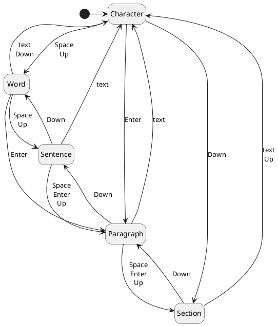

# Jotty

A text editor inspired by Ted Nelson's Jot: <https://xanadu.com/jotinstructions.txt>

This user interface is explicitly not designed for editing highly structured documents such as computer code.  It is intended specifically for entering and editing natural language text.  Other editors with different user interfaces could be created that read and write the same permascroll format (see below).  The editor always represents a single "document" which is intended for drafting or creating new work prior to later export for formatting and dissemination, and can be divided into sections which represent distinct themes or topics.  A title or other notes at the start of each section can indicate the topic.

## Design goals

1. Ensure that work is never lost by
    * retaining all versions and
    * continuously persisting all changes
1. Support rapid and seamless workflow by
    * ensuring all operations can be performed with the keyboard,
    * performing common operations on convenient units of text, and
    * minimising the use of modifier keys
1. Demonstrate concepts from Ted Nelson's designs

## Basic principles

All text input is permanently persisted immediately.

There is no separate "save" operation, only "export" which allows the current
edit buffer or a selected region of it to be output as a normal linear UTF-8
text file.  If this editor is used as a library (for example as a "readline"
replacement) this is triggered by a request to read the current state of the
edit buffer.

All input can be performed entirely with a keyboard.  No pointing device is
assumed or required.  This should make it straightforward to create an audio
user interface for blind users.

Printable character keys (alphanumeric and symbols) always represent themselves
and are not used for editing.  Typing printable characters will always commence
text entry and append to the permascroll.  All editing functions are performed
with the editing keys and/or control characters.

The permascroll is append-only.  Earlier data is never deleted or rewritten.
Undo and redo are not only "unlimited" all the way to the oldest and newest
changes, but inherently create a branching version tree when new changes are
made starting from a previous state.

There is no support for formatting other than optionally markdown-style bold
and italic attributes.  Formatting for print or screen display is a task for
other programs to which some or all of the document can be exported.
Xanadu-style typed links could be part of this as a future enhancement.

User interface design principles include:

1. Reversibility and repeatability

    All operations should be quickly and easily reversible and repeatable,
    so that the user can quickly undo mistakes including mistaken undo
    operations, and can easily test the results of performing or not performing
    the operation.

2. Visibility

    It should always be clear what operation will result from a particular
    input.  This means that the current scope unit, edit marks and selections
    all need to be clearly presented.  Toggle and cycle operations can have
    visual indicators but this is not critical as it is easy to move through
    the states and to anticipate the next action based on the last action
    performed.

3. Consistency and Symmetry

    Related operations should have related inputs.

4. Convention

    Where possible, existing meanings and behaviours for particular keystrokes
    in other systems should be preserved.

## Design notes

All text is encoded as UTF-8 strings.

Can use ANSI terminal control sequences to support remote operation and provide a lowest common denominator for user interface.

Adds a "character" sub-level and a "section" super-level to the original Jot design, so the editing scopes are:

1. character (Unicode "grapheme cluster", not "code point")
2. word
3. sentence
4. paragraph
5. section

The cursor changes to indicate the scope:

1. underscore "_" for character
2. "#" for word
3. "$" for sentence
4. pilcrow "¶" for paragraph
5. section sign "§" for section

This supports the design principle of visibility because the current scope unit is critical information during navigation and the user will be looking at the cursor.  This is better than needing to look elsewhere on the screen, for example a status line, though it can also be secondarily indicated in that way.

A section break is indicated by a horizontal line across the entire window.

Edit marks are indicated with vertical lines "|" which should also be a distinct colour or blinking.

"Selected" text around or between edit marks should have distinct background colors or inverse text.

When there is a single edit mark, the character, word, sentence or paragraph (if any) immediately preceding and following the mark are selected.  When there are two edit marks, the text inbetween the marks is additionally selected.  When there are three edit marks, only the text between the first two and the last two marks are the selections.  Setting additional marks beyond a third will remove the first (oldest) mark.

## User experience design

### User tasks

* Entering (appending) text
* Navigating
* Editing
  * Deleting text
  * Inserting text
  * Moving (re-arranging) text
  * Replacing text
  * Restoring previously deleted or replaced text
* Exporting
* Searching
* Substituting matched text

### Special keys

All special keys are available as standard terminal control sequences and are expected to be available on all normal keyboards.  Key bindings are not configurable in order to promote consistency across all implementations of Jotty but most functions are available via multiple actions including some that are conventional in other editors.

`Space` and `Enter` (`^M`) have different effects depending on the current scope:

1. In character scope, a space after a Unicode "sentence terminal" character
  such as period, exclamation mark or question mark indicates a new sentence.
  Otherwise a space indicates a new word.  Enter indicates a new paragraph.

2. In word scope, a space indicates a new sentence.  If the character before
  the current cursor position (skipping any existing space) is alphanumeric,
  a period will be inserted before the space.  Enter still indicates a new
  paragraph.

3. In sentence scope, either space or enter indicates a new paragraph.
  A newline '\n' will be inserted or skipped over if already present.

4. In paragraph scope, either space or enter indicates a new section.
  A formfeed '\f' will be inserted or skipped over if already present.

5. In section scope, neither space nor enter have any further effect.

Whenever spaces or `Enter` have been input the cursor will change to indicate the current scope and if the scope is now sentence or greater, the next alphabetical character (ignoring punctuation) will be capitalised.  The cursor will change to an upward arrow "↑".  Cursor movement or characters that are neither alphabetical nor punctuation will end the special capitalisation behaviour.

`Left` moves the cursor one scope unit to the left.

`Right` moves the cursor one scope unit to the right.

`Up` increases the current scope, `Down` decreases the current scope.  They both cycle around when reaching the largest or smallest scope.



`^Z` is "undo", and undoing a sequence of spaces as above will remove the new item that has been commenced and go back to the previous scope.

`Backspace` (`^H`) is both "delete" and "undo".  When the last character input was not a space, it will delete one scope unit at a time (initially characters, unless changed with Up/Down) until the beginning of the current insert operation, and will then undo the previous edit operation(s) and continue to delete scope units from previous insertions.  When the last action was not character input, it will undo operations.

`Tab` (`^I`) and `^Y` are "redo" and when the last operation was a deletion or an "undo" it will reverse that last operation and restore any text removed - and if the same state has been reached more than once resulting in multiple versions, it presents the alternatives for selection.  If the last operation was not a deletion or "undo", `Tab` and `^I` merely insert a "tab" character into the edit buffer and `^Y` does nothing.

`Insert` or `^V` creates or removes a new edit mark at the cursor position.

`Delete` or `^X` removes an edit mark under the cursor or the most recent edit mark.  If there are no edit marks, it deletes the current scope unit after the cursor, if any.

`Home` or `^U` will move to the beginning of the current paragraph and set the scope to sentence.  A second "home" will move to the beginning of the section and set the scope to paragraph.  A third "home" will move to the beginning of the document and set the scope to section.  A fourth "home" will return to the starting position and set the scope to character.

`End` or `^D` will move to the end of the current paragraph and set the scope to sentence.  A second "end" will move to the end of the section and set the scope to paragraph.  A third "end" will move to the end of the document and set the scope to section.  A fourth "end" will return to the starting position and set the scope to character.

`PageDown` or `^N` selects the next (newer) entry in the cut buffer starting with the first, `PageUp` or `^P` selects the previous (older) entry starting with the most recent.  "Next" when already at the newest entry and "previous" when already at the oldest entry deselect the cut buffer.  `Escape` and "undo" also deselect the cut buffer.

`Escape` when the cut buffer is not selected brings up a menu, if implemented, or a quit confirmation.  `^Q` and `^W` also bring up a quit confirmation.

In the quit confirmation, `Space`, `Enter`, `^Q` and `^W` confirm the quit while undo and `Escape` cancel it.  Note that no progress will be lost due to a quit.  A quit confirmation may not be required when Jotty is being used as a library as that may be implemented by the calling application.

`^E` or an `Export` menu item allow exporting the entire document (if there are no edit marks), the region beween a single edit mark and the cursor, or the region between the first and last edit marks if there is more than one edit mark.  A file name will be required and the output will be written as a linear UTF-8 sequence of the selected characters.  This action may not be available when Jotty is being used as a library to provide an editor window for another application which is then responsible for requesting the contents of the edit buffer as required.

If implemented, `^O` or an `Import` menu item allow importing external documents at the current cursor position as a single insert operation.

`^J` or a `Join` menu item joins the current sentence with the next by moving the cursor to and removing the next period, then lowercasing the next alphabetical character after the cursor, or alternatively if the sentence is the last in the current paragraph, joins the current paragraph with the next by replacing the line breaks with a space.  As always, undo reverts this.

If implemented, `^A` cycles the current scope unit, the region between a single edit mark and the cursor, or the region between the first and last edit marks through markdown-style *italic*, **bold**, ***bold-italic*** and back to unstyled text again.

If search is implemented, `^F` or a `Find` menu item is used to find text, `^G` finds the next instance of the current search string and `^B` finds the previous instance of the current search string.  If substitution is implemented, `^R` or a `Replace` menu item specifies replacement text that will be substituted for the search string within the current scope unit or the entire document if in character scope (the default).

The `F1` key (and also `^?` and `Shift-F1`) or a `Help` menu item displays a "cheat sheet" showing the scope units and corresponding cursor glyphs, the key bindings and a description of the use of edit marks.

A minimal implementation need not have either a menu or a "cut buffer" and the corresponding actions.  When the cut buffer is implemented, it can optionally be displayed as a separate panel visible only when entered using the next/previous actions or alternatively as a distinct window.  Each cut buffer entry should start with the timestamp followed by the text.  The cut buffer can have a limited number or duration of entries.

### Keyboard bindings diagram

```svgbob
+-------+-------+-------+-------+-------+-------+-------+-------+-------+-------+
|   Q   |   W   |  E    |   R   |   T   |   Y   |   U   |   I   |   O   |   P   |
| Quit  | Quit  |Export |Replace|T'clude| Redo  | Home  |  Tab  |Import | Prev  |
+---+---+---+---+---+---+---+---+---+---+---+---+---+---+---+---+---+---+---+---+
    |   A   |   S   |   D   |   F   |   G   |   H   |   J   |   K   |   L   |
    |Attrib |       | End   | Find  | Again | BkSpc | Join  |Unlink | Link  |
    +---+---+---+---+---+---+---+---+---+---+---+---+---+---+---+---+-------+
        |   Z   |   X   |   C   |   "V" |   B   |   N   |   M   |
        | Undo  |Unmark | Cut   | Mark  | Back  | Next  | Enter |
        +-------+-------+-------+-------+-------+-------+-------+

+-------+-------+-------+       +----------+    +----------+    +-----------+
|  Ins  | Home  | PgUp  |       |   Tab    |    |Backspace |    |   Enter   |
| Mark  | Home  | Prev  |       |"Tab/Redo"|    |"Del/Undo"|    |"Enter/Cut"|
+-------+-------+-------+       +----------+    +----------+    +-----------+
|  Del  |  End  | PgDn  |
|Unmark |  End  | Next  |
+-------+-------+-------+
```

The `^S` binding is not used both because it can signify XOFF ("stop transmission") and also because it conventionally repesents "Save" which is not required in Jotty since all actions are immmediately persisted.  The `Ins`, `Del`, `Home`, `End`, `PgUp` and `PgDn` keys all have alternate alphabetic bindings because it may be more convenient than the placement of those functions on some keyboards.

### Suggested menu items

If a menu is implemented, at least the following entries should exist:

* File
  * Import
  * Export
  * Quit
* Edit
  * Join
  * Find
  * Replace
* Help

Menu items for undo/redo and mark/cut/copy/paste are not recommended because these are very common operations and selecting from the menu is too cumbersome.

### Editing

When there is one edit mark, `Space` will exchange the highlighted strings on either side of the edit mark.  When there are two or three edit marks, `Space` will exchange the highlighted strings on either side of the second edit mark. A second `Space` will revert this, as will undo.

When there is one edit mark, `Enter` or `^C` will remove the highlighted string after the mark and append it to the "cut buffer" stack.  When there are two edit marks, `Enter` or `^C` will remove the highlighted string between the marks.  When there are three edit marks, `Enter` or `^C` will remove both highlighted strings into the cut buffer as separate entries.  A second `Enter` or `^C` will revert this, as will undo.  This newly created cut buffer entry becomes the current cut buffer selection and the cut window, if implemented, is scrolled or redrawn to present it.

When there is one edit mark, typing printable characters will delete the highlighted string after the edit mark and commence inserting new text at the edit mark.  The edit mark will be deleted.  When there are two or three edit marks, typing printable characters will delete the highlighted string between the first two marks and commence inserting at the first edit mark.  All marks will be deleted.

When an entry in the cut buffer is selected with the "next" and "previous" actions (but not with the "cut" action), navigation with up-down-left-right and placing and removing edit marks apply to that cut buffer entry.  Space or enter will copy the entire cut buffer entry or the highlighted region between two cut buffer edit marks to the current cursor position.  It will have no effect if there are one or three edit marks in the cut buffer.  Additional spaces or enters will copy the same string again each time.  Typing printable characters will deselect the cut buffer and insert into the edit buffer at the current cursor position as usual.

### Status line

The last line of the screen should be reserved for a status line which should show the following information:  The name and version of the program, the current and total number of sections, the current and total number of paragraphs in the current section, the current and total number of sentences in the current section, the current and total number of words in the current section and the current and total number of characters in the current section.  The current scope unit will be highlighted.  The right side of the status line can optionally display a message like "F1=Help".  If the status area is not long enough to display all the information, the help message can be omitted, then the program name and version, and finally only the section information and the current scope unit information can be displayed, or ultimately only the current scope unit information.

`Jotty v0  §0/0 ¶0/0 $0/0 #0/0 @0/0`

## Internal data representation

There is an edit buffer containing UTF-8 text which represents the current state of the document and optionally a cut buffer that contains various excised strings, each with a creation timestamp.

The edit and cut buffers are constructed from lists of references to (transclusions from) the permascroll, each of which is a byte offset and a length pointing into the text string of "Insert" operations.  Only versions within the portion of the permascroll that has been read will be visible in the user interface.

An operation list records all operations performed in the current edit session that have not yet been undone, and all changes to the operation list are converted to Permascroll operations and regularly persisted.  This can be via a library or a network API.

The edit buffer and cut buffer can be fully or partially reconstructed when editing is resumed by reading some or all of the permascroll.

The current cursor position and up to three "edit mark" positions are recorded as character (not byte) offsets into the edit buffer.  These are not recorded in the permascroll and could be persisted to storage separately in order to preserve them on exit.

The edit window is a vertically scrolling window rendering a visible portion of the edit buffer with word wrapping.  Words longer than a certain size (initially 10 characters) could be visually broken at the right edge of the window in which case a phantom hyphen (with a distinct display attribute, such as reversed text) should be displayed in the last column to indicate the break.  Cursor movement will skip over this phantom hyphen as it is not actually present in the edit buffer.  The cursor position must always be visible within the edit window, so it will need to be scrolled or redrawn if the cursor is moved beyond the window boundaries or the window is resized.  Likewise the cut window, if implemented, is a vertically scrolling panel or window rendering a visible portion of the cut buffer in chronological order and the currently selected cut buffer entry must always be visible within the cut window.  There could also be an optional version window showing the branching tree of operations generated from the operation list which is displayed only when the last action was "undo" or "redo", or alternatively constantly visible or sharing space with the cut window.

## Feature sets

The minimum viable product supports entering text (without the special behaviour for attributes), navigating, editing and exporting.  Additional features can include: markdown-style attribute support, a version window, a single-entry cut buffer, a larger cut buffer with multiple entries, a menu, and configuration options such as colours, word wrap settings and visibility and size of the version and cut windows.

## Advanced features

* Use a hash such as CityHash over the region of the document being modified
  by recent operations to detect when previous states are revisited and attach
  operations to earlier parents, thus automatically creating the version tree.
* Visualise and navigate the "cut buffer", document history and versioning
  in the style of Ted Nelson's Zigzag: <https://xanadu.com.au/zigzag/>
* Implement "old school" arranging and pasting from the cut buffer
  (multi-select in a specified order).
* Add (unique) naming of sections and a table of contents
* Support transcluding from elsewhere in the permascroll and from external
  sources using `^T`
* Support Xanadu-style multi-ended links stored in a linkbase using `^L`
* Implement 2D and 3D graphical user interfaces and an audio-only
  user interface.
* Implement multi-user editing.  This is inherently based on multiversion
  concurrency control (MVCC).  Every user is creating their own versions,
  but the user interface can show and permit transcluding from remote versions.
