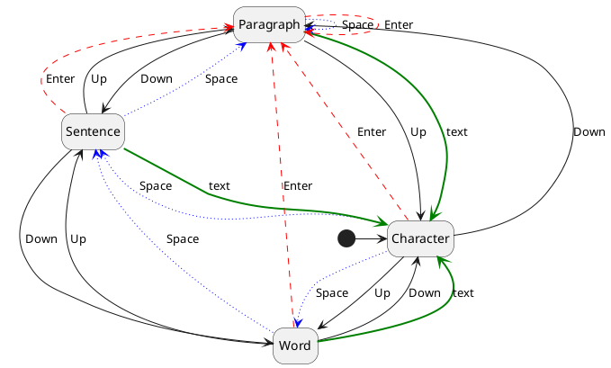
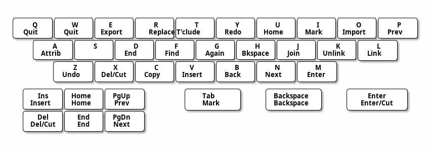
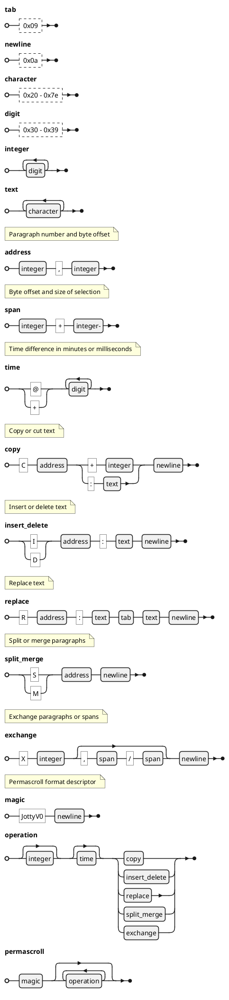

# Jotty

A text editor inspired by Ted Nelson's Jot:
<https://xanadu.com/jotinstructions.txt>

The primary goal is to demonstrate a keyboard-only user interface that makes
revising and rearranging text fast and convenient.

This user interface is explicitly not designed for editing highly structured
documents such as computer code.  It is intended specifically for entering and
editing natural language text.  Other editors with different user interfaces
could be created that read and write the same permascroll format (see below).
The editor always represents a single "document" which is intended for drafting
or creating new work prior to later export for formatting and dissemination, or
it might be embedded within another system for structural organisation and
presentation such as Ted Nelson's Zigzag.

## Table of Contents

1. [How to download and use](#how-to-download-and-use)
2. [Design goals](#design-goals)
3. [Basic principles](#basic-principles)
4. [Design notes](#design-notes)
5. [User experience design](#user-experience-design)
6. [Internal data representation](#internal-data-representation)
7. [Permascroll format](#permascroll-format)
8. [Feature sets](#feature-sets)
9. [Advanced features](#advanced-features)
10. [Acknowledgements](#acknowledgements)
11. [Copyright notice and license](#copyright-notice-and-license)

## How to download and use

Jotty is available for Linux, MacOS and Windows at:
<https://github.com/xanni/jotty/releases>

It must be run inside a terminal window.  Extract the program from the archive,
open a terminal window (for example *Terminal Emulator* or *Windows Terminal*),
change to the directory containing the executable and type the name of the
program.  You can optionally provide a filename for the permascroll which will
default to `jotty.jot` if not provided, or you can use the options `-help` or
`-version` to print out the command line help and program version respectively.

## Design goals

1. Ensure that work is never lost by
    * retaining all versions and
    * continuously persisting all changes
2. Support a rapid and seamless workflow by
    * ensuring all operations can be performed with the keyboard,
    * performing common operations on convenient units of text, and
    * minimising the use of modifier keys
3. Demonstrate concepts from Ted Nelson's designs

## Basic principles

All text input is permanently persisted immediately.

There is no separate "save" operation, only "export" which allows the current
edit buffer or a selected region of it to be output as a normal linear UTF-8
text file.  If this editor is used as a library (for example as a "readline"
replacement) this is triggered by a request to read the current state of the
edit buffer.

All input can be performed entirely with a keyboard.  No pointing device is
assumed or required.  This should make it easier to create an audio user
interface for blind users.

Printable character keys (alphanumeric and symbols) always represent themselves
and are not used for editing.  Typing printable characters will always commence
text entry and append to the permascroll.  All editing functions are performed
entirely with the editing keys and/or control characters.

The permascroll is append-only.  Earlier data is never deleted or rewritten.
Undo and redo are not only "unlimited" all the way to the oldest and newest
changes, but inherently create a branching version tree when new changes are
made starting from a previous state.  All cut text is preserved and can always
be reinserted anywhere as often as desired.

Writing is at least as much, if not more, about rearranging text than about
entering it; therefore multiple operations for rapidly and conveniently
rearranging text should be provided.

There is no support for formatting other than optionally markdown-style bold
and italic attributes.  Formatting for print or screen display is a task for
other programs to which some or all of the document can be exported.
Xanadu-style typed links could be part of this as a future enhancement.

User interface design principles include:

1. Reversibility and repeatability

    All operations should be quickly and easily reversible and repeatable so
    that the user can quickly undo mistakes including mistaken undo operations,
    and can easily test the results of performing or not performing the
    operation.

2. Visibility

    It should always be clear what operation will result from a particular
    input.  This means that the current scope unit, edit marks and selections
    all need to be clearly presented.  Toggle and cycle operations can have
    visual indicators but this is not critical as it is easy to move through
    the states and to anticipate the next action based on the last action
    performed.

3. Consistency and Symmetry

    Related operations should have related inputs.

4. Convention

    Where possible, existing meanings and behaviours for particular keystrokes
    in other systems should be preserved.

## Design notes

All text is encoded as UTF-8 strings.

Can use ANSI terminal control sequences to support remote operation and provide
a lowest common denominator for user interface.

Adds a "character" sub-level to the original Jot design, so the editing scopes are:

1. character (Unicode "grapheme cluster", not "code point")
2. word
3. sentence
4. paragraph

The cursor changes to indicate the scope:

1. underscore "_" for character
2. "#" for word
3. "$" for sentence
4. pilcrow "¶" for paragraph

This supports the design principle of visibility because the current scope unit
is critical information during navigation and the user will be looking at the
cursor.  This is better than needing to look elsewhere on the screen, for
example a status line, though it can also be secondarily indicated in that way.

### Edit marks

Edit marks are indicated with vertical lines "|" which should also be a distinct
colour or blinking.  In this implementation, edit marks must all be within the
same paragraph.  Placing an edit mark in a different paragraph will clear any
existing edit marks.

"Selected" text around or between edit marks should have distinct background
colors or text attributes.  There is a primary and a secondary selection.

In this documentation, "first", "second", "third" and "fourth" refer to the edit
marks in ascending order of their character position within the paragraph, which
is not required to correspond with the sequence in which the marks were created.

When there is a single edit mark and the cursor is at the mark, the character,
word, sentence or paragraph (if any) immediately following the mark is the
primary selection and the same scope unit (if any) immediately preceding the
mark is the secondary selection.  As a special case, if the scope is paragraph
and the mark is at the first character of the paragraph, the entire preceding
paragraph (if any) is the secondary selection.

When there are two edit marks, the text inbetween the marks is the primary
selection and the scope unit immediately following the second mark is the
secondary selection.  When there is a single edit mark and the cursor is not at
the mark, the cursor acts as a second edit mark.

When there are three edit marks, the text between the first and second marks is
the primary selection and between the second and third marks is the secondary
selection.

When there are four edit marks, the text between the first and second marks is
the primary selection and between the third and fourth marks is the secondary
selection.  Setting additional marks beyond a fourth will remove the oldest mark.

## User experience design

### User tasks

* Entering (appending) text
* Navigating
* Editing
  * Deleting text
  * Inserting text
  * Moving (re-arranging) text
  * Replacing text
  * Restoring previously deleted or replaced text
* Exporting
* Searching
* Substituting matched text

### Special keys

All special keys are available as standard terminal control sequences and are
expected to be available on all normal keyboards.  Key bindings are not
configurable in order to promote consistency across all implementations of Jotty
but most functions are available via multiple actions including some that are
conventional in other editors.

`Space` and `Enter` (`^M`) have different effects depending on the current scope:

1. In character scope, a space after a Unicode "sentence terminal" character
  such as period, exclamation mark or question mark indicates a new sentence.
  Otherwise a space indicates a new word.  Enter indicates a new paragraph.

2. In word scope, a space indicates a new sentence.  If the character before
  the current cursor position (skipping any existing space) is alphanumeric,
  a period will be inserted before the space.  Enter still indicates a new
  paragraph.

3. In sentence and paragraph scopes, either space or enter indicates a new
  paragraph.

Whenever spaces or `Enter` have been input the cursor will change to indicate
the current scope.  If the scope is now sentence or greater, the next
alphabetical character (ignoring punctuation) will be capitalised and the
cursor will instead change to an upward arrow "↑".  Cursor movement, entering a
capitalised alphabetical character or any characters that are neither
alphabetical nor punctuation will end the special capitalisation behaviour and
the cursor will revert to the scope indicator.

`Left` moves the cursor one scope unit to the left.

`Right` moves the cursor one scope unit to the right.

`Up` increases the current scope, `Down` decreases the current scope.  They both
cycle around when reaching the largest or smallest scope.

`Backspace` (`^H`) will delete the current scope unit before the cursor, if any.
At the beginning of a paragraph, it will append the current paragraph to the
previous one separated by a space and thus merge them into a single paragraph.

`Delete` or `^X` deletes the current scope unit after the cursor, if any.  At
the end of a paragraph, it will append the next paragraph to the current one
separated by a space and thus merge them into a single paragraph.

`^C` copies the current scope unit after the cursor, if any, to the cut buffer.

`^Z` is "undo", which reverts the state of the document to the immediately
preceding version persisted to the permascroll.  Once the document is back to
the initial empty state it has no further effect.

`^Y` is "redo" and when the last operation was a deletion or an "undo" it will
reverse that last operation and restore any text removed - and if the same state
has been reached more than once resulting in multiple versions, it presents the
alternatives for selection.  If the last operation was not a deletion or "undo",
`^Y` does nothing.

`Tab` (`^I`) creates or removes a new edit mark at the cursor position.
`Shift-Tab` clears all edit marks if implemented.

`Insert` or `^V` inserts the currently selected entry in the cut buffer, if any,
at the cursor position.

`Home` or `^U` will move to the beginning of the current paragraph and set the
scope to sentence.  A second "home" will move to the beginning of the document
and set the scope to paragraph. A third "home" will return to the starting
position and set the scope to character.

`End` or `^D` will move to the end of the current paragraph and set the scope to
sentence.  A second "end" will move to the end of the document and set the scope
to paragraph.  A third "end" will return to the starting position and set the
scope to character.

`PageDown` or `^N` selects the next (newer) entry in the cut buffer starting
with the first, `PageUp` or `^P` selects the previous (older) entry starting
with the most recent.  "Next" when already at the newest entry and "previous"
when already at the oldest entry deselect the cut buffer.  `Escape` and "undo"
also deselect the cut buffer.

`Escape` when the cut buffer is not selected brings up a menu, if implemented,
or the help screen.

`^Q` and `^W` bring up a quit confirmation.  In the quit confirmation, `Space`,
`Enter`, `^Q` and `^W` confirm the quit while `Escape` cancels it.  Note that no
progress will be lost due to a quit. A quit confirmation may not be required
when Jotty is being used as a library as that may be implemented by the calling
application.

`^E` or an `Export` menu item allow exporting the primary selection or if there
are no edit marks, the entire document.  A file name will be required and the
output will be written as a linear UTF-8 sequence of the selected characters.
This action may not be available when Jotty is being used as a library to
provide an editor window for another application which is then responsible for
requesting the contents of the edit buffer as required.

If implemented, `^O` or an `Import` menu item allow importing external documents
at the current cursor position as a single insert operation.

`^J` or a `Join` menu item joins the current sentence with the next by moving
the cursor to the end of the current sentence and removing the terminating
punctuation, then lowercasing the next alphabetical character after the cursor,
or alternatively if the sentence is the last in the current paragraph, joins the
current paragraph with the next separated by a space.  As always, undo reverts
this.

If implemented, `^A` cycles the primary selection or if there are no edit
marks, the current scope unit through markdown-style *italic*, **bold**,
***bold-italic*** and back to unstyled text again.

If search is implemented, `^F` or a `Find` menu item is used to find text, `^G`
finds the next instance of the current search string and `^B` finds the previous
instance of the current search string.  If substitution is implemented, `^R` or
a `Replace` menu item specifies replacement text that will be substituted for
the search string within the current scope unit or the entire document if in
character scope (the default).

The `Help` menu item displays a "cheat sheet" showing the scope units and
corresponding cursor glyphs, the key bindings and a description of the use of
edit marks.

A minimal implementation need not have either a menu or a "cut buffer" and the
corresponding actions.  When the cut buffer is implemented, it can optionally be
displayed as a separate panel visible only when entered using the next/previous
actions or alternatively as a distinct window.  Each cut buffer entry should
start with the timestamp followed by the text.  The cut buffer can have a
limited number or duration of entries.

### Keyboard bindings diagram

The `^S` binding is not used both because it can signify XOFF ("stop
transmission") and also because it conventionally repesents "Save" which is not
required in Jotty since all actions are immmediately persisted.  The `Ins`,
`Del`, `Home`, `End`, `PgUp` and `PgDn` keys all have alternate alphabetic
bindings because it may be more convenient than the placement of those functions
on some keyboards.

### Suggested menu items

If a menu is implemented, at least the following entries should exist:

* File
  * Import
  * Export
  * Quit
* Edit
  * Join
  * Find
  * Replace
* Help

Menu items for undo/redo and mark/copy/insert/delete are not recommended because
these are very common operations and selecting from the menu is too cumbersome.

### Editing

When edit marks are present, `Space` will exchange the text indicated by the
primary and secondary selections.  A second `Space` will revert this, as will
undo.  This was called a "switcheroo" in Ted's original designs.

When there is one edit mark, `Enter`, `Del` or `^X` will remove the primary
selection after the mark and append it to the "cut buffer" stack.  When there
are two edit marks, `Enter`, `Del` or `^X` will remove the primary selection
between the marks.  When there are three or four edit marks, `Enter`, `Del` or
`^X` will remove both the primary and the secondary selection into the cut
buffer as separate entries.  The newly created cut buffer entry containing the
former primary selection becomes the current cut buffer selection.  The cut
window, if implemented, is scrolled or redrawn to present it and the edit marks
are removed.  `^C` will perform the same actions but copying rather than
removing the selection(s) from the source.

When there is one edit mark, typing printable characters will delete the primary
selection after the edit mark and commence inserting new text at the edit mark.
When there are two or more edit marks, typing printable characters will delete
the primary selection between the first two marks and commence inserting at the
first edit mark.  All marks will then be removed.

When an entry in the cut buffer is selected with the "next" and "previous"
actions (but not with the "cut" or "copy" actions), navigation with
up-down-left-right and placing and removing edit marks apply to that cut buffer
entry.  `Space` or `Enter` will copy the entire cut buffer entry or the primary
selection between two cut buffer edit marks to the current cursor position.
Additional spaces or enters will copy the same selection again each time.
Typing printable characters will deselect the cut buffer and insert into the
edit buffer at the current cursor position as usual.

### Status line

The last line of the screen should be reserved for a status line which should
show the following information:  The name and version of the program, the
current and total number of paragraphs, the current and total number of
sentences, the current and total number of words and the current and total
number of characters.  The current scope unit will be highlighted.  The right
side of the status line can optionally display a message like "ESC=Help" or
"ESC=Menu".  If the status area is not long enough to display all the
information, the help message can be omitted, then the program name and version,
and finally if necessary only the current scope unit information can be
displayed.

`Jotty v0  ¶0/0 $0/0 #0/0 @0/0`

Exit confirmations and error messages can also be displayed on the status line
and act as modal dialogues, remaining until acknowledged. `Space`, `Enter`
or `Esc` will accept an error message.

### Text attributes

The defaults are white text on a black background with the cursor blinking and
reversed, edit marks blinking yellow, primary selections in reversed black on
red and secondary selections in underlined magenta.

## Internal data representation

There is an edit buffer containing UTF-8 text which represents the current state
of the document and optionally a cut buffer that contains various excised
strings, each with a creation timestamp.  The edit buffer and cut buffer can be
fully or partially reconstructed when editing is resumed by reading some or all
of the permascroll.

The current cursor position and up to four "edit mark" positions are recorded as
paragraph and character (not byte) offsets into the edit buffer.  These are not
recorded in the permascroll and could be persisted to storage separately in
order to preserve them on exit.

The edit window is a vertically scrolling window rendering a visible portion of
the edit buffer with word wrapping.  Words longer than a certain size (initially
10 characters) could be visually broken at the right edge of the window in which
case a phantom hyphen (with a distinct display attribute, such as reversed text)
should be displayed in the last column to indicate the break.  Cursor movement
will skip over this phantom hyphen as it is not actually present in the edit
buffer.  The cursor position must always be visible within the edit window, so
it will need to be scrolled or redrawn if the cursor is moved beyond the window
boundaries or the window is resized.  Likewise the cut window, if implemented,
is a vertically scrolling panel or window rendering a visible portion of the cut
buffer in chronological order and the currently selected cut buffer entry must
always be visible within the cut window.  There could also be an optional
version window showing the branching tree of operations generated from the
operation list which is displayed only when the last action was "undo" or
"redo", or alternatively constantly visible or sharing space with the cut
window.

## Permascroll format

This implementation differs from the earlier Xanadu designs in the following ways:

1. Since this is designed for the paragraph-structured Jotty editor, the
   permascroll maintains the two-level addressing scheme which allows the use of
   suboptimal but simpler data structures such as Go slices rather than
   augmented partial sum trees.

2. Rather than storing the primedia (the actual textual contents of the
   document) separately from the list of operations, here they are combined and
   the primedia source addresses point into the body of the "insert" operations
   in the permascroll.

3. Text deletions are recorded in the permascroll rather than using a
   rearrangement to a negative address.

4. Each operation can be optionally preceded by a number of operations that must
   be skipped in order to reach the parent operation in a particular version of
   the document.  This is normally omitted in the common case that the parent is
   the immediately preceding operation and the delta is therefore zero.

5. If timestamps of operations are recorded, in order to save space the format
   used is the number of minutes or if less than one minute the number of
   milliseconds since the previous timestamp. The first timestamp in the
   permascroll is the time since the epoch, which is midnight on 2020-01-01.
   Timestamps are purely for display purposes and are therefore optional.

Operations are recorded in the permascroll as follows:

### Permascroll format design considerations

* The operations must all be reversible to support undo.  This is why deletions
  and replacements record the text that has been deleted or replaced.

* The records should be human readable to assist debugging and aid understanding
  of the format and the concepts represented by the design.  This is why no
  control characters are used other than tab and newline, and numeric values are
  recorded as decimal strings.

* The records should be compact where possible to save space.  This is why
  operation codes are a single character and parents and timestamps are recorded
  as differences.

## Feature sets

The minimum viable product supports entering text (without the special behaviour
for attributes), navigating, editing and exporting.  Additional features can
include: markdown-style attribute support, a version window, a single-entry cut
buffer, a larger cut buffer with multiple entries, a menu, and configuration
options such as colours, word wrap settings and visibility and size of the
version and cut windows.

## Advanced features

* Use a hash over the document to detect when previous states are revisited and
  attach operations to earlier parents, thus automatically creating the version
  tree.
* Visualise and navigate the "cut buffer", document history and versioning
  in the style of Ted Nelson's Zigzag: <https://xanadu.com.au/zigzag/>
* Implement "old school" arranging and pasting from the cut buffer
  (multi-select in a specified order).
* Support transcluding from elsewhere in the permascroll and from external
  sources using `^T`
* Support Xanadu-style multi-ended links stored in a linkbase using `^L`
* Implement 2D and 3D graphical user interfaces and an audio-only
  user interface.
* Implement multi-user editing.  This is inherently based on multiversion
  concurrency control (MVCC).  Every user is creating their own versions,
  but the user interface can show and permit transcluding from remote versions.

## Acknowledgements

Thanks to Dr. Katherine Phelps for her support and encouragement, Dr. Ted Nelson
for the inspiration and friendship, and Christoph Schwentker, Yoshida Yukihiko
and Kenichi Unnai for reviewing the translations.

## Copyright notice and license

Copyright © 2024 Andrew Pam <mailto:andrew@sericyb.com.au>

This program is free software: you can redistribute it and/or modify it under
the terms of the GNU General Public License as published by the Free Software
Foundation, either version 3 of the License, or (at your option) any later
version.

This program is distributed in the hope that it will be useful, but WITHOUT ANY
WARRANTY; without even the implied warranty of MERCHANTABILITY or FITNESS FOR A
PARTICULAR PURPOSE. See the GNU General Public License for more details.

You should have received a copy of the GNU General Public License along with
this program. If not, see <https://www.gnu.org/licenses/>.
